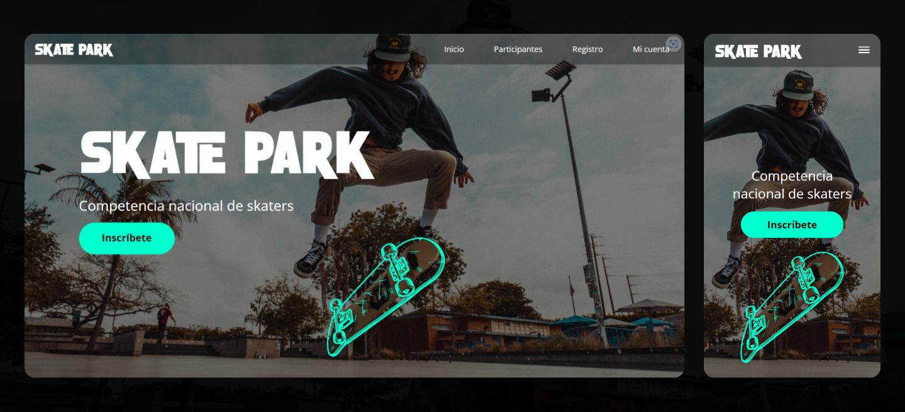
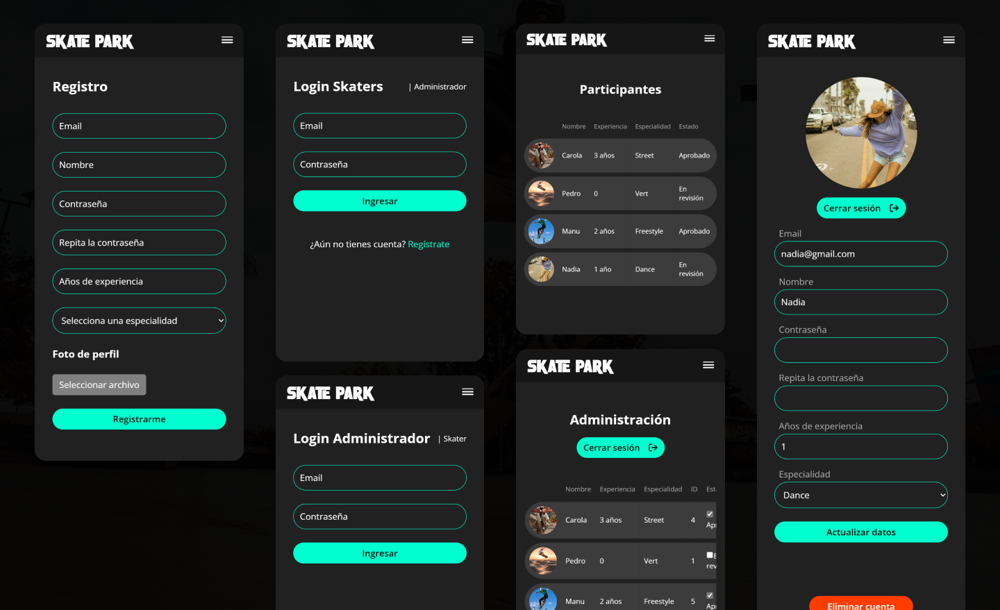

# Skate Park





## Objetivos

- Crear una API REST con el Framework Express. 
- Servir contenido dinámico con express-handlebars. 
- Ofrecer la funcionalidad Upload File con express-fileupload. 
- Implementar seguridad y restricción de recursos o contenido con JWT

## Rutas para renderizar las vistas

| Ruta             | Middleware                  | Descripción                                                                           |
|------------------|-----------------------------|---------------------------------------------------------------------------------------|
| /ping            | -                           | Comprueba si el servidor está en funcionamiento.                                      |
| /                | -                           | Renderiza la vista de inicio (Home).                                                  |
| /participantes   | -                           | Renderiza la vista de participantes.                                                  |
| /registro        | authMiddleware.soloPublico  | Renderiza la vista de registro, solo accesible para usuarios no autenticados.         |
| /login           | authMiddleware.soloPublico  | Renderiza la vista de inicio de sesión, solo accesible para usuarios no autenticados. |
| /perfil          | authMiddleware.soloSkater   | Renderiza la vista del perfil de usuario, solo accesible para usuarios autenticados.  |
| /loginAdmin      | authMiddleware.soloPublico  | Renderiza la vista de inicio de sesión de administrador,solo accesible para usuarios no autenticados.|
| /admin           | authMiddleware.soloAdmin    | Renderiza la vista de administrador, solo accesible para administradores autenticados.|

## Rutas de la API

| Ruta                | Método | Controlador                  | Descripción                                            |
|---------------------|--------|------------------------------|--------------------------------------------------------|
| /api/getSkaters     | GET    | skateController.getSkaters   | Obtener todos los skaters de la base de datos.         |
| /api/getAdmins      | GET    | getAdminsController          | Obtener todos los administradores de la base de datos. |
| /api/getSkater      | POST   | skateController.getSkater    | Obtener un skater específico por su email.             |
| /api/deleteSkater/:email | DELETE | skateController.deleteSkater | Eliminar un skater por su email.                  |
| /api/updateSkater   | PUT    | skateController.updateSkater | Actualizar la información de un skater.                |
| /api/skaterStatus   | PUT    | skateController.skaterStatus | Cambiar el estado de un skater (aprobado/ en revisión).|
| /api/login          | POST   | authController.login         | Iniciar sesión de un usuario skater.                   |
| /api/loginAdmin     | POST   | authController.loginAdmin    | Iniciar sesión de un administrador.                    |
| /api/register       | POST   | authController.register      | Registrar un nuevo usuario skater.                     |
| /api/logout         | POST   | logoutController             | Cerrar sesión de un usuario.                           |


## Dependencias usadas

| Dependencia          | Versión   |
|----------------------|-----------|
| cookie-parser        | ^1.4.6    |
| dotenv               | ^16.4.5   |
| express              | ^4.19.2   |
| express-fileupload   | ^1.5.0    |
| express-handlebars   | ^7.1.2    |
| handlebars           | ^4.7.8    |
| jsonwebtoken         | ^9.0.2    |
| pg                   | ^8.11.5   |
| uuid                 | ^9.0.1    |

## Ejecución en Render
Esta aplicación ha sido desplegada en [este enlace](https://prueba-skate-park.onrender.com/) (no puedes crear cuenta de administrador ya que se crea desde el servidor).


Puedes visualizar credenciales en las siguientes rutas:
- Administrador: [https://prueba-skate-park.onrender.com/api/getAdmins](https://prueba-skate-park.onrender.com/api/getAdmins)
- Usuarios: [https://prueba-skate-park.onrender.com/api/getSkaters](https://prueba-skate-park.onrender.com/api/getSkaters)

## Instalación y ejecución local

1. Clona o descarga el repositorio.
2. Instala las dependencias:
``` npm install express cookie-parser dotenv express-fileupload express-handlebars express-handlebars handlebars jsonwebtoken pg uuid ```

3. Crea una base de datos, configúrala en /db/config.js y añade las variables de entorno en el archivo .env-ejemplo
4. Crea una tabla para usuarios: 
```
CREATE TABLE skaters (
	id SERIAL, 
	email VARCHAR(50) unique not null,
	nombre VARCHAR(25) NOT NULL,  
	contraseña VARCHAR(25) NOT NULL, 
	anos_experiencia INT NOT NULL, 
	especialidad VARCHAR(50) NOT NULL, 
	foto VARCHAR(255) NOT NULL, 
	estado BOOLEAN NOT null
);
```
5. Crea una tabla para administradores e inserta los datos para poder acceder al panel de admin:
```
create table admin (
	id serial,
	email varchar(50) not null,
	nombre varchar(50) not null,
)
```

6. Ejecuta el servidor.


